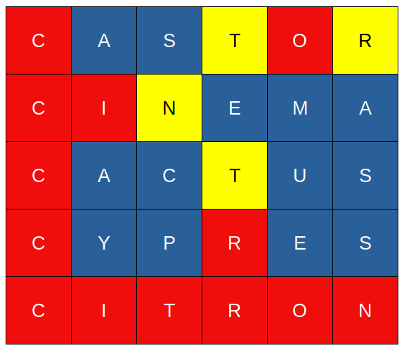

# PHP : SUTOM

## Objectif pour l'apprenant

Mettre en oeuvre les capacités acquises en cours de formation en réinvestissant ce qui a été appris en situation professionelle en lien avec un besoin simple: réaliser une interface web permettant de jouer à MOTUS en ligne

  

## Présentation du projet

### Objet du document

Ce document s'adresse à des étudiants apprenant les bases du développement web.

  

### Objectifs du projet

Vous devez créer un site web permettant de jouer au jeu MOTUS. 
Pour ce faire, vous devez appliquer les bonnes méthodes de conception web.

Afin de vous faciliter la compréhension des fonctionnalités attendues, une version déjà existante en ligne existe :https://sutom.nocle.fr.
Il est attendu, avant tout, de recevoir un livrable **fonctionnel** et de **qualité**. Ainsi privilégiez et peaufinez la première exercice et organisez-vous bien pour la répartition des tâches et la gestion du dépôt git.

  

### Critères d'acceptabilité du produit

- La logique implémentée doit utiliser le langage appris en cours, le PHP.
- Le(s) document(s) livrés doivent être responsive
- un projet complet et fonctionnel versionné sous git
- Le(s) document(s) livrés doivent être respectueux de la RGPD.
- l'application doit être accessible en français ou anglais au minimum
- Vous pouvez également héberger votre site sur le support de votre choix, voire sur [Heroku](https://www.heroku.com/)

  

## Règles du motus

Le _**Motus**_ est initiallement un jeu télévisé français, adapté de l'émission américaine _Lingo_.
Le jeu repose sur la recherche de mots d'un nombre fixé de lettres. L'objectif du projet ici n'est pas de faire deux joueurs ou équipes qui s'affrontent mais simplement un joueur qui joue comme sur SUTOM.

Lors du premier affichage de la page,un mot est défini aléatoirement par le serveur mais n'est pas affiché à l'utilisateur.
L'utilisateur, lui, voit le nombre de lettres ainsi que la première lettre du mot. 

Suite à celà, l'utilisateur doit proposer un mot pouvant convenir.
Le mot doit contenir le bon nombre de lettres et être correctement orthographié.
Le mot proposé par le joueur doit exister dans le dictionnaire. 
Si le mot n'existe pas, le mot n'est pas validé et le joueur ne peut donc tester le bon positionnement des lettres.
 
Une fois le mot validé, il apparaît alors sur une grille : les lettres présentes et bien placées sont coloriées en rouge, les lettres présentes mais mal placées sont cerclées de jaune. Pour une lettre, on ne peut avoir au maximum que le nombre d'occurrences de cette lettre dans le mot de coloriées (soit en jaune, soit en rouge si certaines sont bien placées). Afin de comprendre cette dernière phrase, observez le fonctionnement de cactus dans l'exemple ci-après

Après 6 tentatives ratées, le site ne permets plus à l'utilisateur de continuer et lui annonce le résultat qui était attendu.

# Méthodologie

Par équipe lisez ce sujet, puis relisez le. 
Afin de bien apréhender le besoin n'hésitez pas à consulter le site de sutom et peut-être en faire une partie pour comprendre les tenants et aboutissants. 
Puis répartissez-vous les tâches. 

N'oubliez pas qu'une borne organisation est essentielle pour la réussite de tout projet. Ainsi prenez le temps de communiquer entre vous et faites des points régulier ce qui permets d'avancer correctement et ensemble.

## Etape 1

  Concevez le site internet. Il doit être conçu en HTML 5, CSS 3 et PHP. Il doit permettre :
  
- L'ordinateur propose aléatoirement un mot, puis un résultat est affiché en fonction des règles mentionnées ci-dessus.
- à l'utilisateur de soumettre une valeur

Ce site doit être esthétique et intuitif pour l'utilisateur.

Afin de pouvoir tester votre site, il vous est conseillé de rajouter un bouton permettant de relancer une partie. N'oubliez pas avant la livraison finale de retirer ce bouton .

En exemple de dictionnaire se trouve au sein du dossier _data_. Il est issu du dépôt https://github.com/hbenbel/French-Dictionary/.
Vous n'êtes pas obligés d'utiliser ce dictionnaire. Le site pourrait tout à fait utiliser un dictionnaire de noms de pokemons à la place par exemple.

Attention à bien filter les données car : 
- Le mot proposé ne doit contenir aucun accent
- Le mot proposé ne doit pas contenir de tiret ni d'apostrophe
- Le mot proposé ne doit pas contenir de lettre particulière œ, ç etc...

# Etape 2
Un utilisateur peut se connecter sur le site pour avoir des fonctionnalités avancées. En plus de son nom d'utilisateur ainsi que son mot de passe encrypté, votre site stockera son adresse IP, un timestamp lié à la date de création de son compte, ainsi qu'un autre timestamp lié à sa date de dernière connection.

L'utilisateur doit avoir accès à une section expliquant le concept du jeu et son fonctionnement. 

Attention à stocker au sein de votre git, la structure SQL de la base de données.

## Etape 3
Le mot proposé par le site doit toujours être le même en fonction du jour en cours. Les mots proposés doivent faire entre 6 à 10 lettres.
Il est possible de changer de langue ( deux dictionnaires : un français, l'autre anglais )
Un joueur pourra donc jouer deux fois par jour.

## Etape 4

Un utilisateur connecté peut avoir les statistiques suivantes :
- Nombre de victoires du visiteur, Nombre d'abandons et Nombre d'échecs
- Positionnement face à classement mondial
- Temps moyen d'une partie

## Bonus
Comme pour le site de SUTOM, vous pouvez ajouter une aide visuelle, permettant de voir quelles lettres ne font pas partie du mot final. 

Dans le jeu télévisé initial, il y avait une contrainte temporelle. 
Le joueur doit proposer un mot dans un délai maximal de huit secondes et doit épeler celui-ci. Sinon, une pénalité est appliquée, le site considèrera qu'un mot de lettres vides a été envoyé et ne validera aucun point.  

# Conseils

- Vous pouvez utiliser des frameworks !